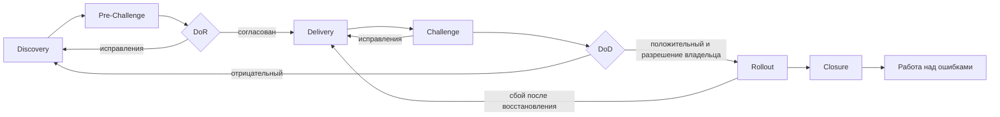

# Производственный процесс 0xExqui.OS 2.4.4

**Процесс — тоже часть продукта.** Я разрабатываю 0xExqui.OS с AI-агентами и использую этот процесс, чтобы доводить идеи до проверенного результата: от решения о границах до выпуска и разбора ошибок. Это правила для соло-разработки, а не готовая методика для любой команды.

[Скачать ZIP версии 2.4.4](https://github.com/0xParshikov/Product-Development-Process-by-0xParshikov/archive/refs/tags/v2.4.4.zip) · [Открыть файлы версии](https://github.com/0xParshikov/Product-Development-Process-by-0xParshikov/tree/v2.4.4) · [Посмотреть процесс на сайте](https://0xexqui.com/process/)

В выпуск входят [AGENTS.md](AGENTS.md) с правилами взаимодействия и ответственностью ролей, [ENGINEERING.md](ENGINEERING.md) с циклом работы и [manifest.json](manifest.json) с происхождением и контрольными суммами. Версия 2.4.4 действует в рабочих инициативах 0xExqui.OS с 19 сентября 2026 года. Её главное уточнение: архитектурный дизайн ведёт основной агент, а CTO проверяет его независимо.

## Как процесс менялся

Каждая версия добавляла контроль там, где предыдущей не хватало. Даты показывают фиксацию правил, а не их применение в каждой задаче.

| Версия | Дата | Что изменилось |
| --- | --- | --- |
| 1.0 | 26.08.2026 | Первый управляемый путь от идеи до выпуска. |
| 2.0 | 02.09.2026 | Контрольные точки и границы доказательств. |
| 2.1 | 04.09.2026 | Роли, восемь фаз и автономная Delivery. |
| 2.2 | 05.09.2026 | EPIC-000, проверка и работа над ошибками. |
| 2.3 → 2.3.1 | 10.09.2026 | Superpowers, независимые роли и первый публичный пилот. |
| 2.4 | 12.09.2026 | Проект отделён от эпика; новый эксперимент. |
| 2.4.1 | 14.09.2026 | Учёт багов и четыре показателя; превосходство не доказано. |
| 2.4.2 | 17.09.2026 | Общие документы, пределы циклов и доклад DoD до выпуска. |
| 2.4.3 | 19.09.2026 | Ответственность основного агента и разбор разногласий ролей. |
| **2.4.4** | **19.09.2026** | Автор архитектурного дизайна и независимая проверка CTO. |

## От задачи до выпуска

Масштаб определяет цикл. **Задача** даёт один самостоятельный результат без эпика. **Эпик** объединяет до семи пользовательских историй. **Проект** объединяет связанные эпики; его EPIC-000 сначала определяет общую цель, архитектуру и порядок работы.

**DoR** фиксирует согласованные границы до реализации. В **Challenge** роли проверяют результат по своим областям; замечания возвращают работу в Delivery. **DoD** предъявляет владельцу подтверждённое и незавершённое до публикации. После разрешения следует **Rollout** — выпуск проверенной версии, затем **Closure** и независимый разбор ошибок. У EPIC-000 свой короткий цикл: Project Discovery → Project Challenge → DoR проекта → Closure → Работа над ошибками. Подробные условия переходов и возвратов находятся в [ENGINEERING.md](ENGINEERING.md).

## Один владелец. Шесть независимых ролей

| Роль | За что отвечает |
| --- | --- |
| Product Owner | Собирает истории и критерии, проверяет результат по пути пользователя. |
| CTO | Требует простого технического решения и независимо проверяет архитектуру. |
| Дизайн-директор | Сверяет интерфейс и текст с согласованным образцом. |
| Главный администратор | Проверяет доступ, запуск, состояние и восстановление. |
| CyberSec | Проверяет данные, доступы, секреты и состав публикации. |
| Руководитель процесса | Следит за фазами, пределами проверок и разбором ошибок. |

Роли не принимают решение вместо владельца и не проверяют собственную работу. Их точные полномочия описаны в [AGENTS.md](AGENTS.md).

## Карта документов

Общие правила живут в Платформе; цель и критерии — в проекте; детали реализации и доказательства — в текущем эпике.

| Уровень | Основные файлы | Назначение |
| --- | --- | --- |
| Платформа | `AGENTS.md`, `ENGINEERING.md` | Роли и цикл работы. Эти два файла опубликованы здесь. |
| Платформа | `ARCHITECTURE.md`, `NETWORK.md`, `DEPLOYMENTS.json`, `RISKS.md` и другие | Архитектура, размещение и рабочие реестры конкретной системы. В этот выпуск не входят. |
| Проект | `README.md`, `PROJECT.md`, `DESIGN.md`, `ROADMAP.md`, при необходимости `BUGS.md` | Работающие возможности, истории, дизайн, порядок эпиков и открытые дефекты. |
| Эпик | `DESIGN.md`, `PLAN.md`, `reviews/` | Решение текущего эпика, план и независимые проверки. |

Файлы связаны назначением, а не выстроены в очередь. Новые документы появляются по мере необходимости; исторические снимки остаются в Git.

## «Маяк»: проверка изменений процесса

В лаборатории одну задачу проводят по двум версиям правил в изоляции, затем сравнивают результаты и следы работы. Смотрят на четыре показателя: **срок** до результата, **расход** токенов и известных затрат, **качество** по дефектам и переделкам, **прерывания** из-за незапланированного вмешательства владельца.

Синтетический прогон подтвердил механику сравнения. Отдельный пилот не доказывает, что версия процесса универсально лучше или подойдёт полноценной команде. [Подробнее о лаборатории и пилотах](https://0xexqui.com/process/#mayak).

## Как использовать комплект

1. Прочитайте `AGENTS.md` и `ENGINEERING.md` вместе.
2. Замените `<PLATFORM_ROOT>` на корень своей Платформы и подготовьте документы своего проекта, перечисленные в `ENGINEERING.md`.
3. Подключите правила к своему AI-инструменту. Навыки Superpowers устанавливаются отдельно.
4. Соотнесите проверки, документы и права доступа со своей средой: архитектура, сеть, рабочие реестры и правила интерфейса 0xExqui.OS не входят в этот комплект.

Публичная копия сохраняет правила версии 2.4.4. В ней заменён локальный путь Платформы и убраны ссылки на файлы, которые не опубликованы в этом репозитории. Исходные контрольные суммы и перечень этих изменений указаны в [manifest.json](manifest.json).
